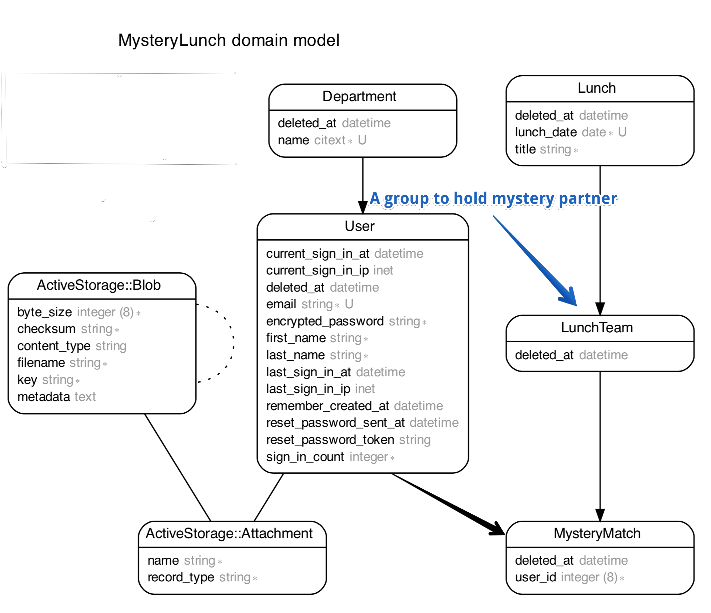

# Mystery Lunch Matching Application

## About

This is a Ruby on Rails application, which helps to create mystery matches for employees.
Mystery lunch is part of the creditshelf culture: at the beginning of each month, every employee is
randomly selected to have lunch with another employee of a different department.
Mystery Lunch web application is going accomplish this process of matching.

We have used sampling technique for matching employees for lunch & used devise for authentication.

Application deployed at https://mysterylunch.herokuapp.com/ .

## System dependencies

1. `Ruby 2.7.1`
2. `Rails 6.0.3`
3. `Postgres`
4. `Docker for Mac`
5. `NODEJS`
6. `YARN`

## Development Setup

- Build Docker

  `docker-compose build`

- Database creation

  `docker-compose run web rake db:setup`

- Start the Application
  `docker-compose up`

## How to run the test suite

`docker-compose run web bash`
`SIMPLECOV=true RAILS_ENV=test rspec`

### Data Modeling

#### Department

This model is used to represent a department and also had a relation with user to keep track of manager of a department.
Also I have used `citext` for case insentive indexing for department name.

#### User

This model is used to represent a user & had fields required for authentication as well.
Every user belongs to a department and have many mystery matches.

#### MysteryMatch

It's a kind of join table, which keep tracks of a employee and a lunch team.

##### LunchTeam

It's belongs to lunch and used to hold a group of employees that are matched for a monthly team lunch.

#### Lunch

It's used to keep track of monthly lunch & could be used to store restaurant location.
It has many lunch teams, which means list of all different employees that are made as partner for this lunch.

### Implementation Logic for Matching

I am doing few things to match a employee with another or a pair of two.
So, the steps can summarized as follows.

1. Load employee with his last three partner

2. Get the list of pending employees except from his current department

3. Call `Mystery::FindPartnerService` with the list of employees from point 2 and current employee.
   Then the finder service uses sampling technique to select random employee after rejecting last three partners.

4. If got a employee then it's going to be a partner & we store those list of employees in an array. But when we got nothing
   then we selected employee will be moved to failed list. This normally happens when we ran out of partner.
   Also, we marked partner as matched.

5. Then we try to find the partner for failed employee with existing employee partners of two pair.
   Also update the array if we got any match.

6. At last, we used `Mystery::CreateMatchesService` service to batch import the matchings.

## Patterns of Development

I personally try to keep things simple and small as much as possible. I am a fan of DRY but don't like to go super dry.

Now, I would like share my thought on service directory in this application.

Btw I am a good believer of the single responsibility principle & prefer to have a number of classes instead of having a giant single class.

### Services

Services are PORO and used to perform the operation which is not suitable for model and controller and must adhere the single responsibility principle.

I prefer to expose only one endpoint from the service that would be invoked.

#### app/services/mystery/\*

This directory of services has all services which are used to perform matching or removing future matching incase employee gets deleted.

`Mystery::AddEmployeeToLunchService` is used when a new employee is created & we have to find partner for him.

`Mystery::FindPartnerInTeamService` is used when we have odd number of employees & had to find a 3 pair mystery partners.

`Mystery::DeleteEmployeeFromLunchService` is used when delete an employee which has future lunch. We do nothing for older matchings.

#### app/services/SampleDataLoaderService

I prefer to create a service for sample data because we can test it and it's more managable then noraml `seeds.rb`.

## Deployment instructions

- `git push heroku master`

## Area of improvement

1. Adding pundit for authorization.
2. Bullet gem can be added to improvement the complete operation if introduce N+1 problem.
3. We could try to refactor scheduler service to smaller part.
